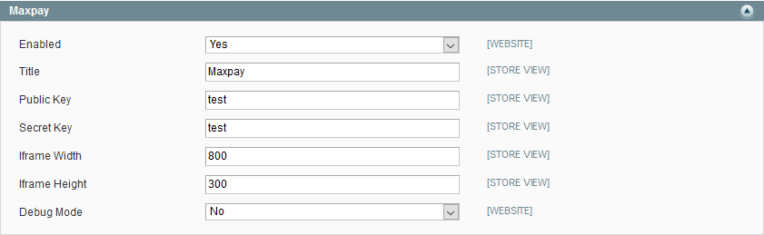

Module for Magento 1.9
=====

Installation
----
Copy all files to `{site root directory}/`

>1. Login to admin interface

>2. Navigate to menu "System" -> "Configuration" 

>3. Open tab "Payment methods"

>4. Choose Maxpay

>5. Enable module and enter all the settings

Callback URL : `https://yoursite/maxpay/payment/callback`

Decline URL : `https://yoursite/maxpay/payment/decline`

Success URL : `https://yoursite/maxpay/payment/success`

-----

Example of "Maxpay" settings:

